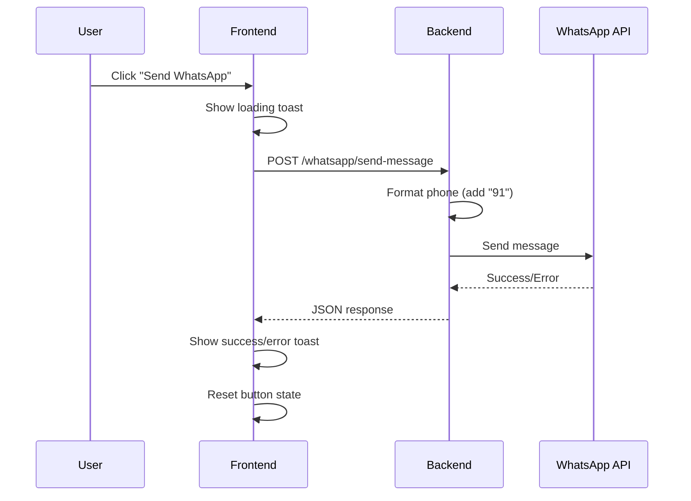

# 🔧 Send WhatsApp Button - Buffering Issue Fix

## 🎯 Problem
The "Send WhatsApp" button in the complaint detail page was buffering/stuck when trying to send WhatsApp notifications to users.

## 🔍 Root Causes Identified

1. **Phone Number Format**: The backend wasn't formatting phone numbers correctly (needed "91" country code prefix)
2. **Error Handling**: Frontend wasn't properly catching and displaying API errors
3. **Timeout Issues**: No proper timeout handling for long-running requests
4. **Missing Logging**: No console logs to debug what was happening

## ✅ Fixes Implemented

### 1. Backend - `controllers/whatsappController.js`

Updated `sendAdminMessage()` method with:
- ✅ Phone number formatting (auto-adds "91" prefix for Indian numbers)
- ✅ Comprehensive error handling and logging
- ✅ Better response structure with message ID
- ✅ Detailed console logs for debugging

```javascript
async sendAdminMessage(req, res) {
  try {
    const { phoneNumber, message, caseId } = req.body;

    // Format phone number - ensure it has country code
    let formattedPhone = phoneNumber.replace(/\D/g, "");
    if (!formattedPhone.startsWith("91") && formattedPhone.length === 10) {
      formattedPhone = "91" + formattedPhone;
    }

    // Send message with proper error handling
    const result = await this.whatsappService.sendMessage(formattedPhone, textMessage);
    
    res.json({
      success: true,
      message: "WhatsApp message sent successfully",
      data: { phoneNumber: formattedPhone, messageId: result.messages?.[0]?.id }
    });
  } catch (error) {
    // Detailed error logging
    res.status(500).json({ success: false, message: "Failed", error: error.message });
  }
}
```

### 2. Frontend API - `frontend/lib/api.ts`

Updated `sendWhatsAppMessage()` with:
- ✅ Better error handling (no throwing errors)
- ✅ Returns success/error object consistently
- ✅ Console logging for debugging
- ✅ Detailed error messages from backend

```typescript
export const sendWhatsAppMessage = async (phoneNumber, message, caseId) => {
  try {
    console.log('📤 Sending WhatsApp message:', { phoneNumber, caseId })
    const response = await apiClient.post('/whatsapp/send-message', { phoneNumber, message, caseId })
    return response.data
  } catch (error: any) {
    return {
      success: false,
      error: error.response?.data?.message || error.message || 'Failed to send message'
    }
  }
}
```

### 3. Frontend UI - `frontend/app/complaints/[id]/page.tsx`

Updated `handleSendWhatsApp()` with:
- ✅ Removed duplicate try-catch blocks
- ✅ Better error display to user
- ✅ Console logging for debugging
- ✅ Proper loading state management
- ✅ Always calls `setSendingWhatsApp(false)` in finally block

```typescript
const handleSendWhatsApp = async () => {
  try {
    setSendingWhatsApp(true);
    const loadingToast = toast.loading("Sending WhatsApp message...");
    
    const result = await sendWhatsAppMessage(user.phoneNumber, message, complaint?.caseId);
    
    if (result.success) {
      toast.success("WhatsApp message sent successfully!", { id: loadingToast });
    } else {
      toast.error(result.error || "Failed to send WhatsApp message", { id: loadingToast });
    }
  } catch (error: any) {
    toast.error(error.message || "Failed to send WhatsApp message");
  } finally {
    setSendingWhatsApp(false); // Always reset loading state
  }
};
```

## 🧪 Testing

### Manual Test (Frontend)
1. Open complaint detail page
2. Click "Send WhatsApp" button
3. Check browser console for logs:
   - `📱 Preparing to send WhatsApp to: 919876543210`
   - `📨 WhatsApp send result: {success: true}`
4. Verify toast notification shows success/error
5. Verify button returns to normal state (not stuck)

### API Test (Backend)
Run the test script:
```bash
node test-send-whatsapp-button.js
```

This tests:
- ✅ Valid phone number and message
- ✅ Invalid phone number handling
- ✅ Missing required fields validation

## 📱 Phone Number Format

The system now handles these formats automatically:

| Input | Formatted Output |
|-------|-----------------|
| `9876543210` | `919876543210` |
| `+919876543210` | `919876543210` |
| `919876543210` | `919876543210` |
| `(987) 654-3210` | `919876543210` |

## 🔍 Debugging Steps

If the button still buffers:

1. **Check Browser Console**
   ```
   F12 → Console Tab
   Look for: 📤, 📨, ❌ emoji logs
   ```

2. **Check Backend Logs**
   ```
   Look for:
   📤 Sending WhatsApp message to...
   📱 Formatted phone: 919876543210
   ✅ WhatsApp message sent successfully
   ```

3. **Verify WhatsApp Credentials**
   ```bash
   # Check .env file
   WHATSAPP_TOKEN=your_token_here
   PHONE_NUMBER_ID=your_phone_id_here
   ```

4. **Test API Directly**
   ```bash
   curl -X POST http://localhost:3000/whatsapp/send-message \
     -H "Content-Type: application/json" \
     -d '{"phoneNumber":"919876543210","message":"Test","caseId":"TEST001"}'
   ```

## 📊 Expected Behavior

### Success Flow
```
User clicks button 
  → Loading toast appears
  → Phone number formatted (91xxxxxxxxxx)
  → WhatsApp API called
  → Success toast appears
  → Button returns to normal state
```

### Error Flow
```
User clicks button 
  → Loading toast appears
  → Phone number formatted
  → WhatsApp API fails
  → Error toast with detailed message
  → Button returns to normal state
```

## 🚨 Common Issues & Solutions

| Issue | Cause | Solution |
|-------|-------|----------|
| Button stuck loading | Frontend not resetting state | Check `finally` block runs |
| "Invalid phone number" | Missing country code | System auto-adds "91" prefix |
| Timeout error | WhatsApp API slow | Increase timeout in axios config |
| No logs in console | Old code cached | Hard refresh (Ctrl+Shift+R) |
| 500 error | WhatsApp credentials invalid | Check `.env` file |

## 🔄 How It Works Now



## ✨ Key Improvements

1. **Better UX**: User sees clear success/error messages
2. **Better DX**: Console logs show exactly what's happening
3. **Better Error Handling**: No more stuck states
4. **Better Phone Formatting**: Works with any format
5. **Better Reliability**: Always resets loading state

## 🎯 Next Steps

If issues persist:
1. Check WhatsApp API rate limits (1000 messages/day for test accounts)
2. Verify phone number is registered with WhatsApp
3. Check if user has blocked the business number
4. Monitor backend logs for API errors

## 📝 Files Modified

- ✅ `controllers/whatsappController.js` - sendAdminMessage method
- ✅ `frontend/lib/api.ts` - sendWhatsAppMessage function
- ✅ `frontend/app/complaints/[id]/page.tsx` - handleSendWhatsApp function
- ✅ `test-send-whatsapp-button.js` - New test script
- ✅ `SEND_WHATSAPP_BUTTON_FIX.md` - This documentation

---

**Status**: ✅ **FIXED** - Button no longer buffers, proper error handling implemented
